# 🚀 Enterprise Application Migration to AWS

### High Availability | Auto Scaling | Monitoring | Disaster Recovery

<p align="center">


</p>

---

# 📌 Project Overview

This project demonstrates an end-to-end migration of a containerized Flask application from a simulated on-premises environment to Amazon Web Services (AWS). The infrastructure was designed following cloud best practices to provide high availability, scalability, monitoring, alerting, and disaster recovery.

The application is deployed on multiple EC2 instances managed by an Auto Scaling Group and served through an Application Load Balancer. Data is stored in Amazon RDS MySQL, monitored with Amazon CloudWatch, backed up to Amazon S3, and protected with IAM Roles and Security Groups.

---

# 🎯 Project Objectives

* Simulate an on-premises application
* Containerize the application using Docker
* Migrate the database to Amazon RDS
* Configure High Availability using an Application Load Balancer
* Automatically scale infrastructure using Auto Scaling Groups
* Monitor infrastructure with Amazon CloudWatch
* Configure email notifications using Amazon SNS
* Perform database backups to Amazon S3
* Demonstrate disaster recovery capabilities

---

# ✨ Features

✔ Dockerized Flask Application

✔ Multi-EC2 High Availability Deployment

✔ Amazon RDS MySQL Database

✔ Application Load Balancer

✔ Auto Scaling Group

✔ CloudWatch Dashboard

✔ CloudWatch Alarms

✔ SNS Email Notifications

✔ Amazon S3 Database Backups

✔ IAM Role Authentication

✔ Health Checks

✔ Disaster Recovery

✔ Enterprise Architecture

---

# 🏗 Architecture

<p align="center">
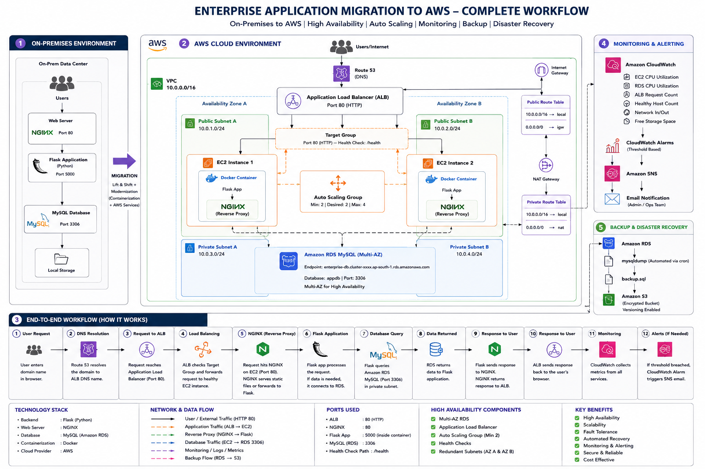
</p>

---

# ☁ AWS Services Used

| Service                   | Purpose                            |
| ------------------------- | ---------------------------------- |
| Amazon EC2                | Hosts Dockerized Flask application |
| Amazon RDS MySQL          | Managed relational database        |
| Amazon S3                 | Database backup storage            |
| Application Load Balancer | Traffic distribution               |
| Target Group              | Health checks and routing          |
| Auto Scaling Group        | Automatic scaling and replacement  |
| Launch Template           | Standardized EC2 configuration     |
| CloudWatch Dashboard      | Infrastructure monitoring          |
| CloudWatch Alarms         | Threshold-based alerting           |
| Amazon SNS                | Email notifications                |
| IAM Role                  | Secure S3 access from EC2          |
| Security Groups           | Firewall configuration             |
| VPC                       | Network isolation                  |
| Public Subnets            | ALB and EC2 networking             |
| Private Database Access   | Secure RDS connectivity            |
| Internet Gateway          | Internet connectivity              |

---

---

# 📸 Project Screenshots

## 🖥️ On-Premises Environment

<table>
<tr>

<td width="50%">

### Docker Containers

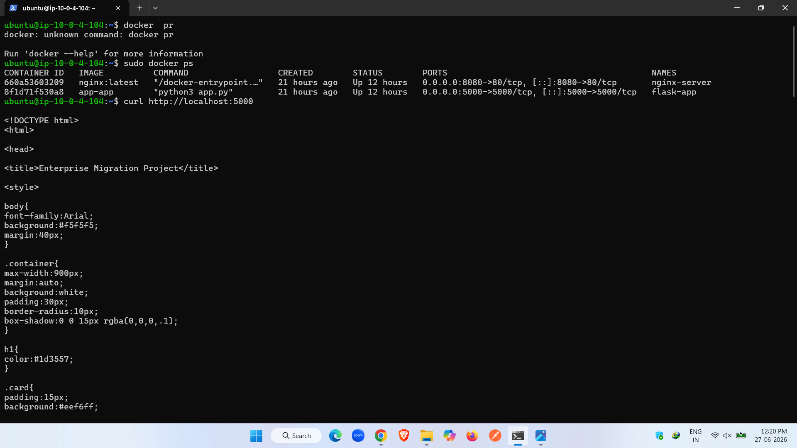

</td>

<td width="50%">

### Flask Application Homepage

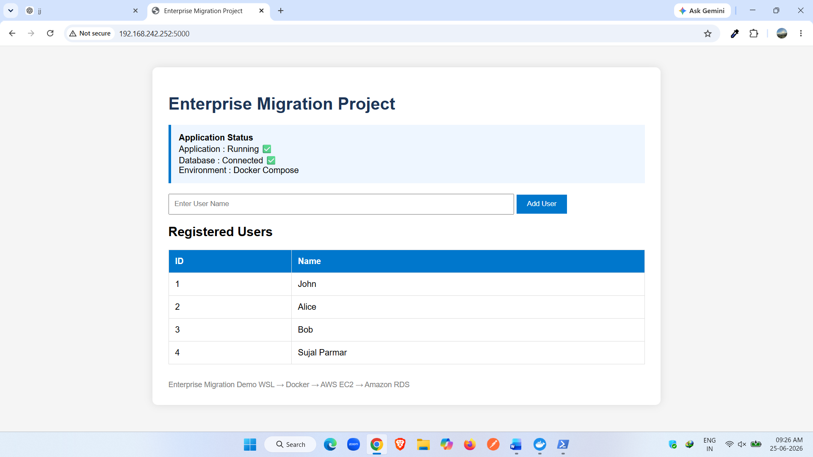

</td>

</tr>
</table>

---

## 🌐 AWS Network Infrastructure

<table>
<tr>

<td width="50%">

### AWS Architecture Diagram


</td>

<td width="50%">

### VPC Configuration

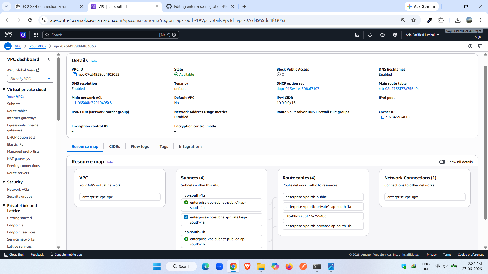

</td>

</tr>
</table>

---

## ☁️ Compute & Database

<table>
<tr>

<td width="50%">

### Amazon EC2 Instances

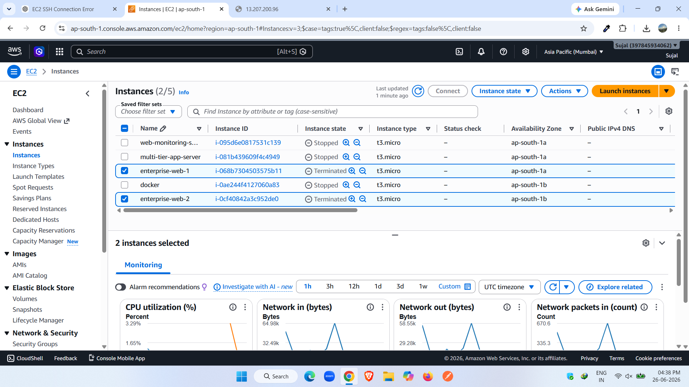

</td>

<td width="50%">

### Amazon RDS MySQL

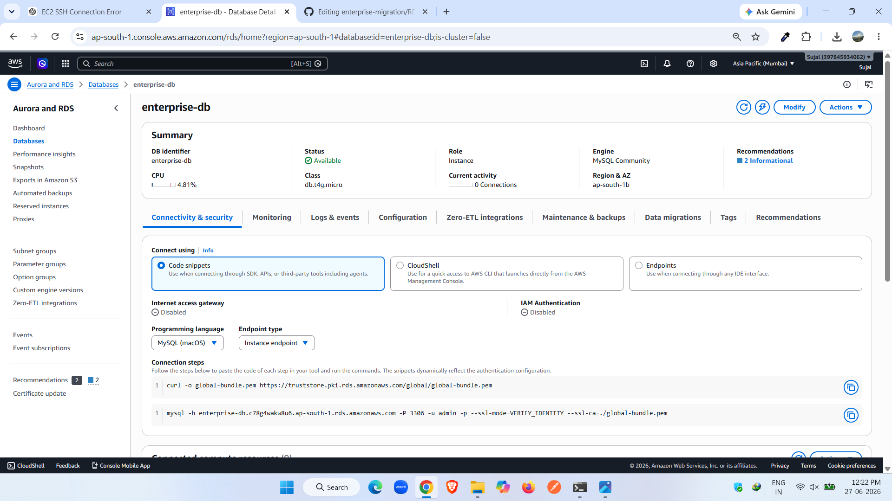

</td>

</tr>
</table>

---

## ⚖️ Load Balancing & High Availability

<table>
<tr>

<td width="50%">

### Application Load Balancer

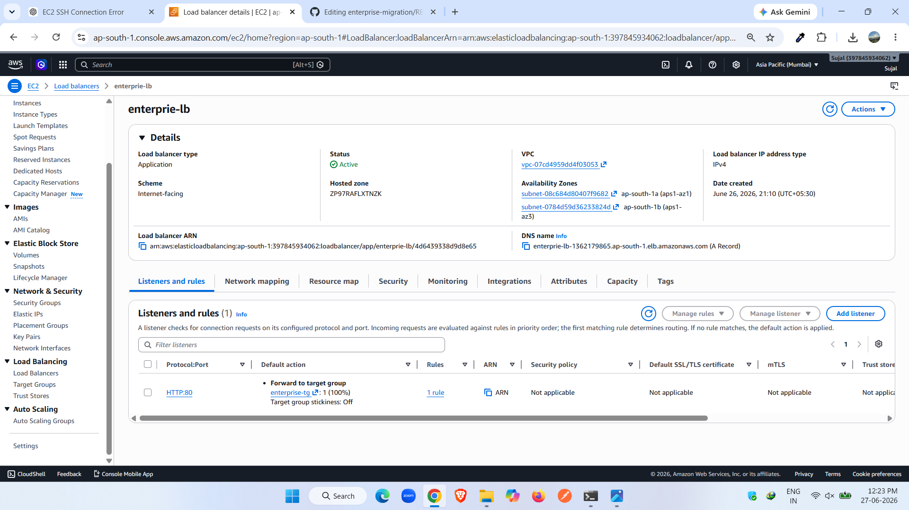

</td>

<td width="50%">

### Target Group Health Checks

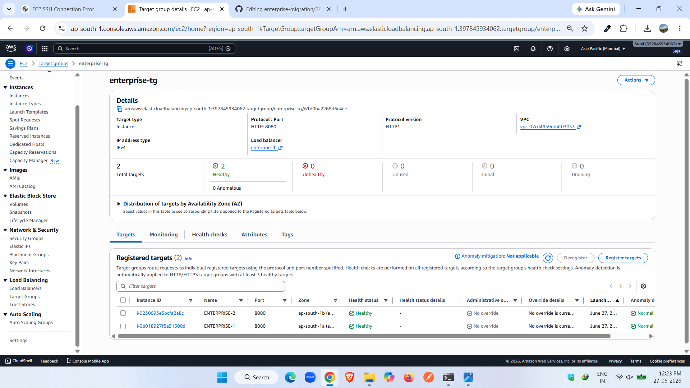

</td>

</tr>
</table>

---

## 📈 Auto Scaling

<table>
<tr>

<td width="50%">

### Auto Scaling Group

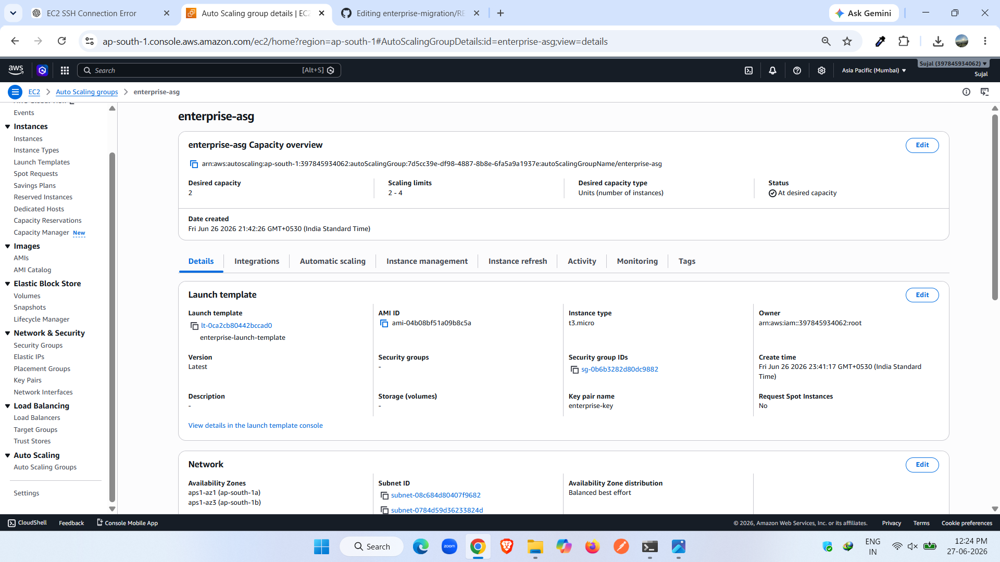

</td>

<td width="50%">

### High CPU Auto Scaling Alarm

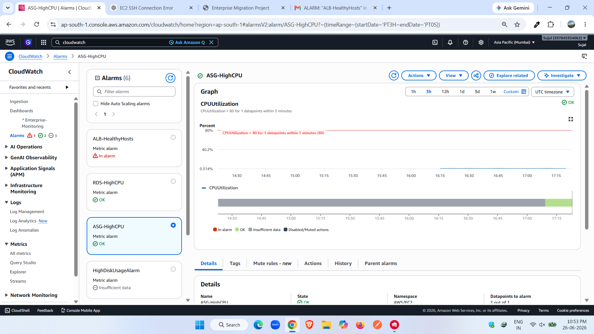

</td>

</tr>
</table>

---

## 📊 Cloud Monitoring

<table>
<tr>

<td width="50%">

### CloudWatch Dashboard

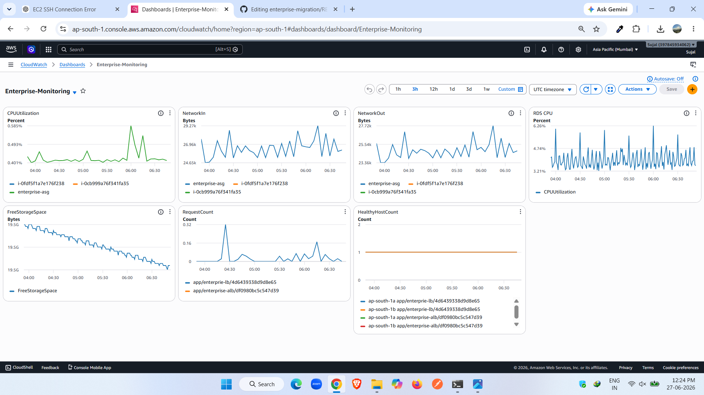

</td>

<td width="50%">

### CloudWatch Alarms

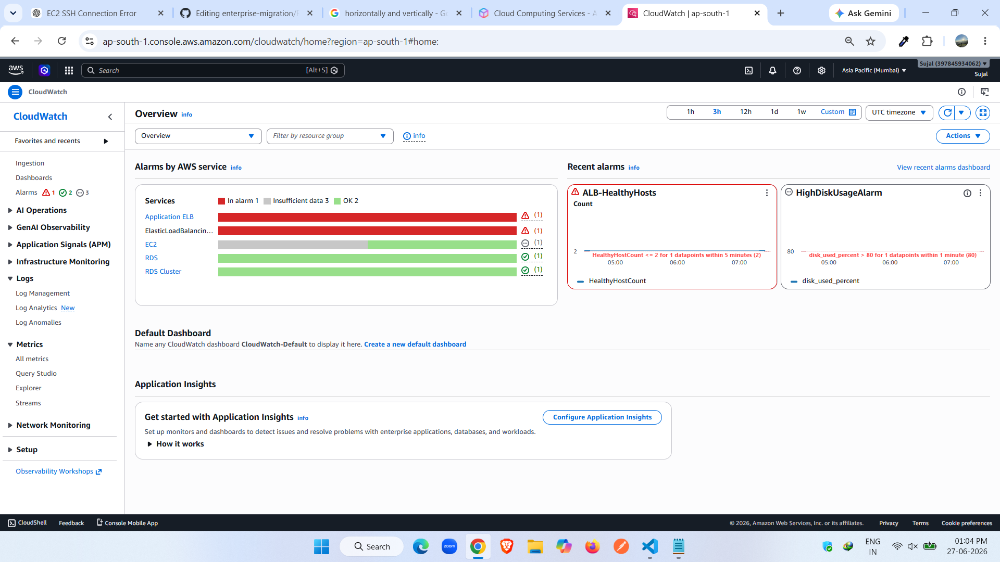

</td>

</tr>
</table>

---

## 🚨 Infrastructure Alerts

<table>
<tr>

<td width="50%">

### ALB Healthy Host Alarm

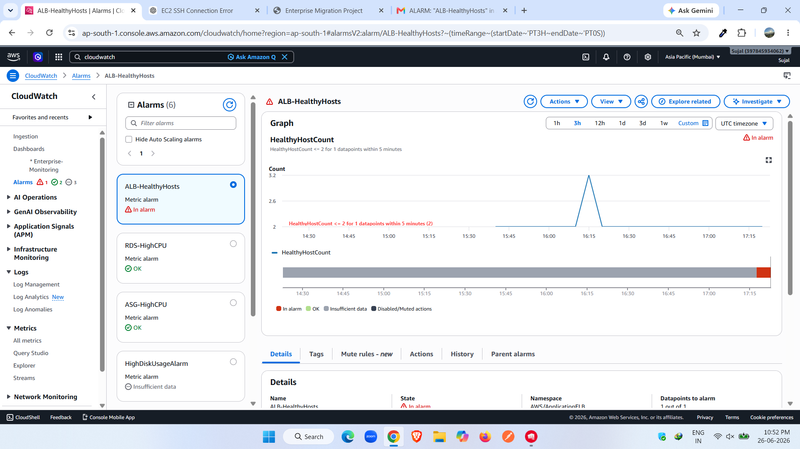

</td>

<td width="50%">

### RDS High CPU Alarm

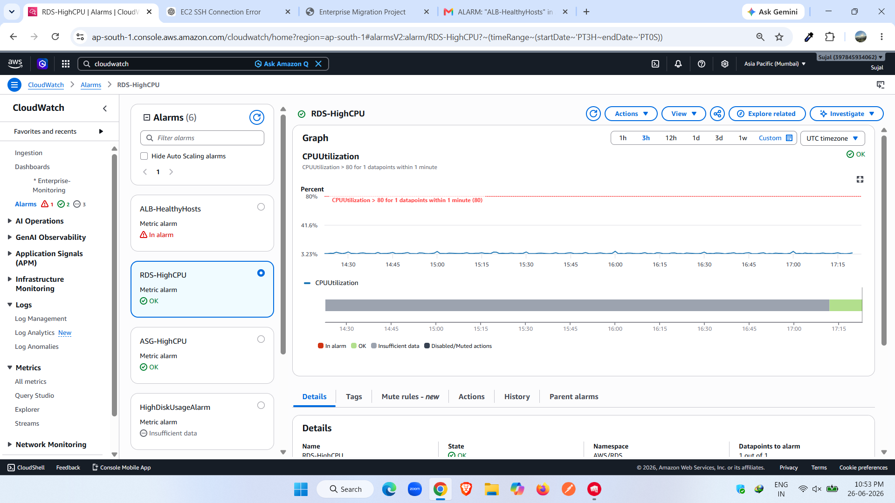

</td>

</tr>
</table>

---

## 🔔 Notifications & Backup

<table>
<tr>

<td width="50%">

### Amazon SNS Email Notification

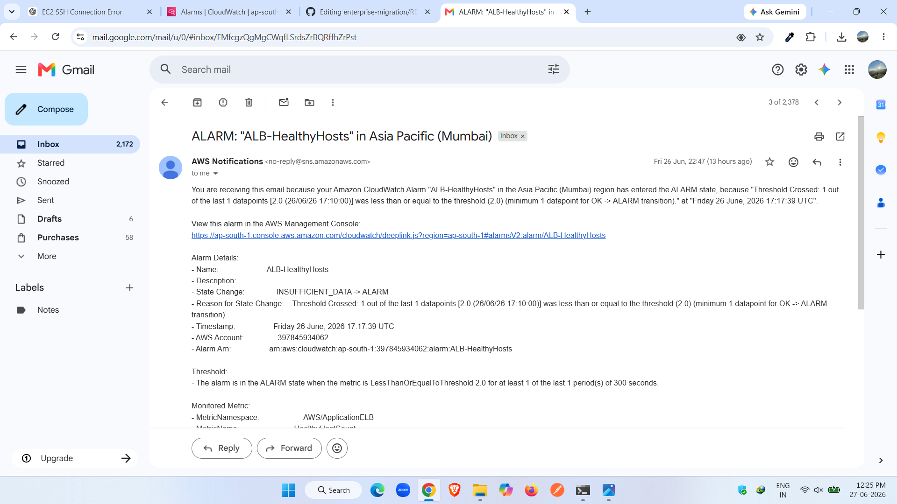

</td>

<td width="50%">

### Amazon S3 Database Backup

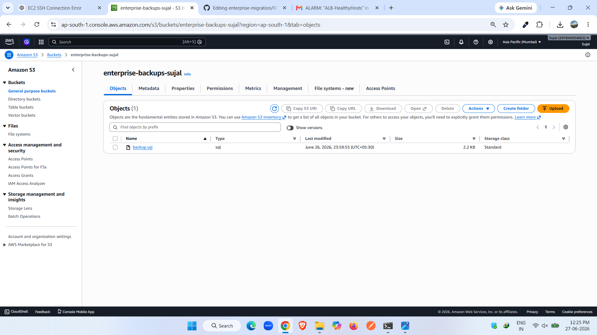

</td>

</tr>
</table>

---

---

# 🚀 Deployment Steps

### 1. Clone Repository

```bash
git clone https://github.com/yourusername/enterprise-migration-aws.git
```

---

### 2. Build Docker Containers

```bash
docker compose up -d
```

---

### 3. Launch AWS Infrastructure

* Create VPC
* Create Public Subnets
* Configure Route Tables
* Create Internet Gateway
* Launch EC2 Instances
* Configure Security Groups

---

### 4. Configure Amazon RDS

* Launch MySQL RDS
* Create appdb database
* Import SQL dump
* Connect Flask application to RDS

---

### 5. Configure Load Balancer

* Create Target Group
* Register EC2 Instances
* Configure Health Checks
* Create Application Load Balancer

---

### 6. Configure Auto Scaling

Minimum Capacity : 2

Desired Capacity : 2

Maximum Capacity : 4

Attach Launch Template

Attach Target Group

---

### 7. Configure Monitoring

Create CloudWatch Dashboard

Add metrics:

* EC2 CPU
* EC2 Network
* RDS CPU
* Free Storage
* ALB Requests
* Healthy Hosts

---

### 8. Configure Alerts

Create CloudWatch Alarms

Configure SNS Email Notifications

---

### 9. Configure Backup

Create Amazon S3 Bucket

Create Database Backup

```bash
mysqldump -h <RDS-ENDPOINT> -u admin -p appdb > backup.sql
```

Upload Backup

```bash
aws s3 cp backup.sql s3://enterprise-backups-sujal/
```

---

# ⚙ High Availability

High availability is achieved using:

* Application Load Balancer
* Target Group Health Checks
* Auto Scaling Group
* Multiple EC2 Instances
* Amazon RDS

If an EC2 instance becomes unhealthy, the Load Balancer automatically stops routing traffic to it. The Auto Scaling Group detects the failure and launches a replacement instance, ensuring the application remains available.

---

# 📊 Monitoring & Alerting

Amazon CloudWatch monitors the infrastructure using dashboards and alarms.

### Dashboard Metrics

* EC2 CPU Utilization
* EC2 Network In
* EC2 Network Out
* RDS CPU Utilization
* RDS Free Storage Space
* ALB Request Count
* Healthy Host Count

### CloudWatch Alarms

| Alarm         | Condition        |
| ------------- | ---------------- |
| EC2 CPU       | Greater than 80% |
| RDS CPU       | Greater than 80% |
| Healthy Hosts | Less than 2      |

Notifications are delivered via Amazon SNS email subscriptions.

---

# 💾 Backup & Disaster Recovery

Database backups are generated using MySQL Dump.

```bash
mysqldump -h <RDS-ENDPOINT> -u admin -p appdb > backup.sql
```

The backup is uploaded securely to Amazon S3 using an IAM Role attached to the EC2 instance.

```bash
aws s3 cp backup.sql s3://enterprise-backups-sujal/
```

In case of failure, the database can be restored using:

```bash
mysql -h <RDS-ENDPOINT> -u admin -p appdb < backup.sql
```

Versioning can be enabled on the S3 bucket to maintain historical backup copies.

---

<p align="center">

### ⭐ If you found this project helpful, consider giving it a star!

Built by **Sujal Parmar**

</p>

